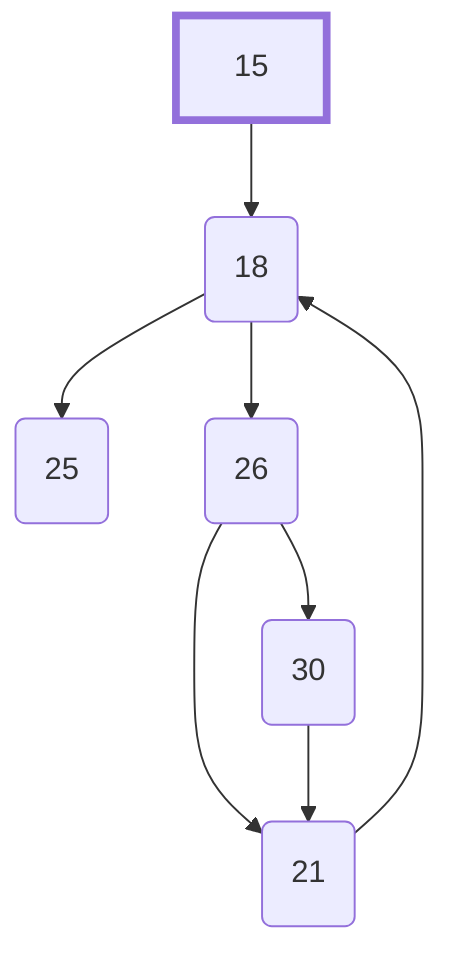
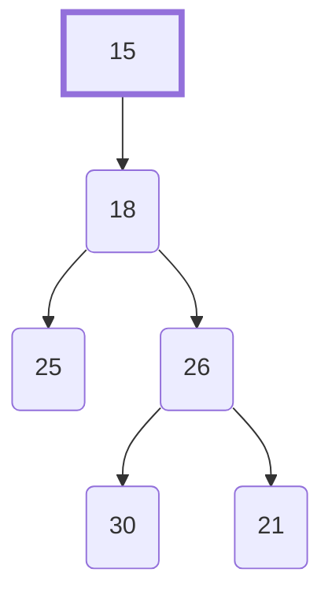

# Example Translation from SPIR-V to LLVM IR

***Disclaimer:*** This document reflects the planned translation algorithms which are not entirely implemented at the time of writing (Jan 3 2018), the algorithms and methods used may change.

For this example, we will start with this GLSL fragment shader:

```glsl
#version 450

in layout(location = 0) float in_;
out layout(location = 0) int out_;

// writes bitwise-reverse of lower 8 bits of in_ to out_
void main()
{
    int result = 0;
    int i = int(in_);
    for(int n = 0; n < 8; n++)
    {
        if((i & (1 << n)) != 0)
            result |= 1;
        result <<= 1;
    }
    out_ = result;
}
```

Which translates to SPIR-V:

```spirv
; note: reordered and formatted for clarity
; file-level stuff
               OpCapability Shader
               OpMemoryModel Logical GLSL450

; extension instruction set import
          %1 = OpExtInstImport "GLSL.std.450"

; entry point
               OpEntryPoint Fragment %main "main" %in_ %out_
               OpExecutionMode %main OriginUpperLeft

; debugging info
               OpSource GLSL 450
               OpName %main "main"
               OpName %in_ "in_"
               OpName %out_ "out_"

; decorations
               OpDecorate %in_ Location 0
               OpDecorate %out_ Location 0

; types, constants, and variables
; base types:
       %void = OpTypeVoid
        %int = OpTypeInt 32 1
       %bool = OpTypeBool

; pointer types
%_ptr_Function_int = OpTypePointer Function %int ; function-local pointer
%_ptr_Input_float = OpTypePointer Input %float ; input variable pointer
%_ptr_Output_int = OpTypePointer Output %int ; output variable pointer

; function type
          %6 = OpTypeFunction %void

; constants
      %int_0 = OpConstant %int 0
      %int_1 = OpConstant %int 1
      %int_8 = OpConstant %int 8

; global variables
        %in_ = OpVariable %_ptr_Input_float Input
       %out_ = OpVariable %_ptr_Output_int Output

; functions
; void main()
       %main = OpFunction %void None %6

         %15 = OpLabel
         %16 = OpLoad %float %in_
         %17 = OpConvertFToS %int %16
               OpBranch %18

         %18 = OpLabel
         %19 = OpPhi %int %int_0 %15 %20 %21
         %22 = OpPhi %int %int_0 %15 %23 %21
         %24 = OpSLessThan %bool %22 %int_8
               OpLoopMerge %25 %21 None
               OpBranchConditional %24 %26 %25

         %26 = OpLabel
         %27 = OpShiftLeftLogical %int %int_1 %22
         %28 = OpBitwiseAnd %int %17 %27
         %29 = OpINotEqual %bool %28 %int_0
               OpSelectionMerge %21 None
               OpBranchConditional %29 %30 %21

         %30 = OpLabel
         %31 = OpBitwiseOr %int %19 %int_1
               OpBranch %21

         %21 = OpLabel
         %32 = OpPhi %int %19 %26 %31 %30
         %20 = OpShiftLeftLogical %int %32 %int_1
         %23 = OpIAdd %int %22 %int_1
               OpBranch %18

         %25 = OpLabel
               OpStore %out_ %19
               OpReturn

               OpFunctionEnd
```

The first step after parsing the input SPIR-V is to construct the Control Flow Graph (CFG):



Then, the [dominator tree](https://en.wikipedia.org/wiki/Dominator_(graph_theory)) is calculated:



Then, the CFG Structure Tree is calculated. The children of each tree node are [topologically sorted](https://en.wikipedia.org/wiki/Topological_sorting) over the CFG, using [reverse postorder](https://en.wikipedia.org/wiki/Depth-first_search#Vertex_orderings).

- `CFGStructureTree`
    - `%15`
    - `Loop`
        - `%18`
        - `%26`
        - `%30`
        - `%21`
    - `%25`

Next, the [uniformity](https://www.khronos.org/opengl/wiki/Core_Language_(GLSL)#Dynamically_uniform_expression) of each SSA variable, memory location, and basic block is calculated using a fixed-point algorithm inspired by [SCCP](https://en.wikipedia.org/wiki/Sparse_conditional_constant_propagation).

The [lattice](https://en.wikipedia.org/wiki/Lattice_%28order%29) used is:


The results are:

| Variable | Uniformity | Basic Block | Uniformity |
|----------|------------|-------------|------------|
| %int_0   | Constant   | %15         | Uniform    |
| %int_1   | Constant   | %18         | Uniform    |
| %int_8   | Constant   | %21         | Uniform    |
| %in_     | Varying    | %25         | Uniform    |
| %out_    | Varying    | %26         | Uniform    |
| %16      | Varying    | %30         | Varying    |
| %17      | Varying    |             |            |
| %19      | Varying    |             |            |
| %20      | Varying    |             |            |
| %22      | Uniform    |             |            |
| %23      | Uniform    |             |            |
| %24      | Uniform    |             |            |
| %27      | Uniform    |             |            |
| %28      | Varying    |             |            |
| %29      | Varying    |             |            |
| %31      | Varying    |             |            |
| %32      | Varying    |             |            |

Finally, all the previously derived information is used to translate to LLVM IR.

Note that I am using 4 as the vectorization length since LLVM doesn't currently support variable length vectors.

```llvm-ir
%struct.GlobalState = type {}
%struct.InvocationState = type {}
%struct.InvocationInput = type { float }
%struct.InvocationOutput = type { i32 }

define zeroext i1 @shader_main(%struct.GlobalState* %global_state, %struct.InvocationState* %invocation_state, %struct.InvocationInput* %invocation_input, %struct.InvocationOutput* %invocation_output) #0 {
  ; %15 = OpLabel
L15:
  ; should be a getelementptr
  %var_in_ = bitcast %struct.InvocationInput* %invocation_input to <4 x float>*
  ; should be a getelementptr
  %var_out_ = bitcast %struct.InvocationOutput* %invocation_output to <4 x i32>*

  ; %16 = OpLoad %float %in_
  ; should be a strided load with stride of 4 bytes
  %id_16 = load <4 x float>, <4 x float>* %var_in_, align 4

  ; %17 = OpConvertFToS %int %16
  %id_17 = fptosi <4 x float> %id_16 to <4 x i32>

  ; OpBranch %18
  br label %L18

  ; %18 = OpLabel
L18:
  ; %19 = OpPhi %int %int_0 %15 %20 %21
  %id_19 = phi <4 x i32> [ zeroinitializer, %L15 ], [ %id_20, %L21 ]

  ; %22 = OpPhi %int %int_0 %15 %23 %21
  %id_22 = phi i32 [ 0, %L15 ], [ %id_23, %L21 ]

  %24 = OpSLessThan %bool %22 %int_8
  %id_24 = icmp slt i32 %id_22, 8

  ; OpLoopMerge %25 %21 None
  ; OpBranchConditional %24 %26 %25
  br i1 %id_24, label %L26, label %L25

  ; %26 = OpLabel
L26:
  ; %27 = OpShiftLeftLogical %int %int_1 %22
  %id_27 = shl i32 1, %id_22

  ; %28 = OpBitwiseAnd %int %17 %27
  ; splat %id_27
  %tmp1 = insertelement <4 x i32> undef, i32 %id_27, i32 0
  %tmp2 = shufflevector <4 x i32> %tmp1, <4 x i32> undef, <4 x i32> zeroinitializer
  %id_28 = and <4 x i32> %id_17, %tmp2

  ; %29 = OpINotEqual %bool %28 %int_0
  %id_29 = icmp ne <4 x i32> %id_28, zeroinitializer

  ; OpSelectionMerge %21 None
  ; OpBranchConditional %29 %30 %21
  ; should be a vector reduce
  %tmp3 = extractelement <4 x i1> %id_29, i32 0
  %tmp4 = extractelement <4 x i1> %id_29, i32 1
  %tmp5 = or i1 %tmp3, %tmp4
  %tmp6 = extractelement <4 x i1> %id_29, i32 2
  %tmp7 = or i1 %tmp5, %tmp6
  %tmp8 = extractelement <4 x i1> %id_29, i32 3
  %tmp9 = or i1 %tmp7, %tmp8
  ; skips L30 if execution mask (%id_29) is all zero
  br i1 %tmp9, label %L30, label %L21

  ; %30 = OpLabel
L30:

  ; %31 = OpBitwiseOr %int %19 %int_1
  %id_31 = or <4 x i32> %id_19, <i32 1, i32 1, i32 1, i32 1>

  ; OpBranch %21
  br label %L21

  ; %21 = OpLabel
L21:
  ; %32 = OpPhi %int %19 %26 %31 %30
  %tmp10 = phi <4 x i32> [ undef, %L26 ], [ %id_31, %L30 ]
  %id_32 = select <4 x i1> %id_29, <4 x i32> %tmp10, <4 x i32> %id_19

  ; %20 = OpShiftLeftLogical %int %32 %int_1
  %id_20 = shl <4 x i32> %id_32, <i32 1, i32 1, i32 1, i32 1>

  ; %23 = OpIAdd %int %22 %int_1
  %id_23 = add i32 %id_22, 1

  ; OpBranch %18
  br label %L18

  ; %25 = OpLabel
L25:
  ; OpStore %out_ %19
  ; should be a strided store with stride of 4 bytes
  store <4 x i32> %id_19, <4 x i32>* %var_out_, align 4

  ; OpReturn
  ret i1 true ; true means not OpKill
}
```
